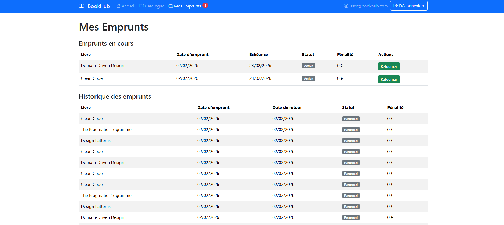
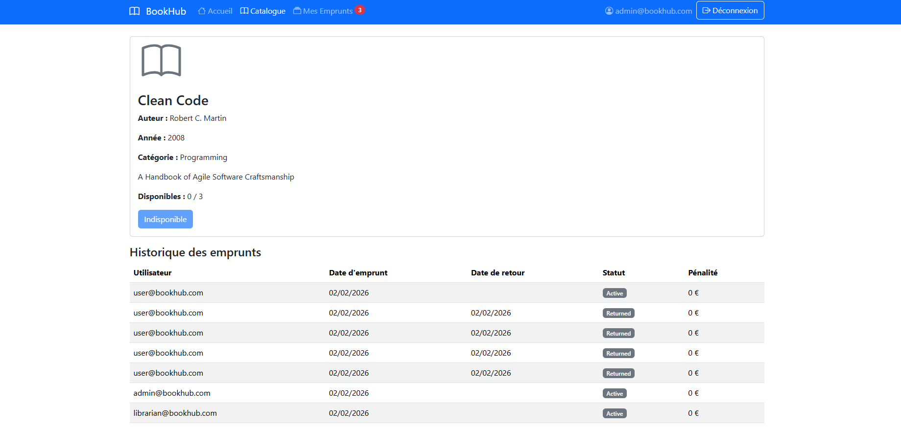
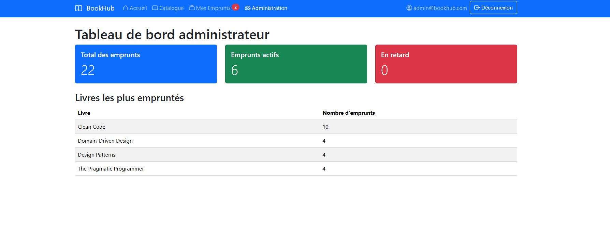
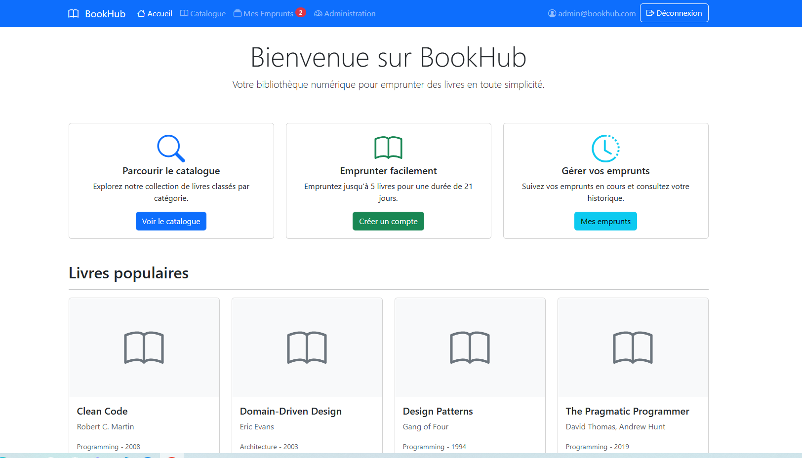

# Étapes effectuées

## **1. Correction du `docker-compose.yml`**  
   - Ajout du service `rabbitmq` avec ports `5672` et `15672`  
   - Vérification des dépendances et network pour tous les services  

## **2. Lancement manuel de PostgreSQL et RabbitMQ**  
   - Utilisation de Docker Desktop pour démarrer les conteneurs  
   - Vérification que PostgreSQL est `healthy` et RabbitMQ est en `Up` 

## **3. Diagrammes d’architecture**

Voici le diagramme global de l’architecture du projet BookHub :

🔗 [Voir le diagramme d’architecture](https://viewer.diagrams.net/?tags=%7B%7D&lightbox=1&highlight=0000ff&edit=_blank&layers=1&nav=1&dark=auto#G1m-vruKjKeDpjlCb3RytkfmjUMNA5SRLU)

## **4. Architecture Decision Records (ADR)**

Les décisions d’architecture du projet sont documentées dans le dossier `docs/ADR/`.
Chaque ADR décrit le contexte, la décision prise, les alternatives envisagées
et les conséquences associées.

## **5. Préparation des bases de données et démarrage des services**

Avant de démarrer les microservices (`CatalogService`, `UserService`, `LoanService`), il est important de s'assurer que la base PostgreSQL est prête et que chaque service a effectué ses migrations pour initialiser correctement ses tables.

### Étapes réalisées

1. **Lancement du conteneur PostgreSQL**
   - Le conteneur `bookhub-postgres` est configuré pour créer plusieurs bases : `bookhub_catalog`, `bookhub_users`, `bookhub_loans`.
   - Un script `init-databases.sh` est exécuté automatiquement pour préparer les bases.
   - Un healthcheck (`pg_isready`) est configuré pour attendre que PostgreSQL soit prêt avant de démarrer les services dépendants.

2. **Migrations des bases**
   - Avant de démarrer chaque service, nous avons exécuté manuellement les migrations EF Core pour créer et mettre à jour les tables dans chaque base respective (`bookhub_catalog`, `bookhub_users`, `bookhub_loans`).
   - Cela garantit que les bases de données sont prêtes et que les services peuvent interagir correctement via leurs endpoints.
   ### Pour CatalogService
   cd src/Services/BookHub.CatalogService
   dotnet ef migrations add InitialCreate
   dotnet ef database update

   ### Pour UserService
   cd ../BookHub.UserService
   dotnet ef migrations add InitialCreate
   dotnet ef database update

   ### Pour LoanService
   cd ../BookHub.LoanService
   dotnet ef migrations add InitialCreate
   dotnet ef database update

## **6. API Gateway (Ocelot)**
   - L’API Gateway centralise les appels vers tous les services (UserService, CatalogService, LoanService) via Ocelot.
   - Dépendances à installer dans le projet **BookHub.ApiGateway** :

```xml
<ItemGroup>
    <PackageReference Include="Microsoft.AspNetCore.Cors" Version="2.3.9" />
    <PackageReference Include="Ocelot" Version="20.0.0" />
</ItemGroup>
```
   - Un fichier `ocelot.json` définit les routes **Upstream → Downstream** pour chaque microservice, avec les méthodes HTTP autorisées.
   - **BaseUrl** : `http://localhost:5167`  
   - Par défaut, ESF utilisait le port `5000`, mais sur mon poste ce port était déjà utilisé par Docker Desktop.  
   - Le port 5167 a donc été configuré pour l’API Gateway.
   - CORS : seules les requêtes provenant du Blazor client (`http://localhost:8080`) sont autorisées.
   - Au démarrage, Ocelot lit la configuration JSON et ajoute les routes dans le pipeline ASP.NET Core.

 **Grâce à cette configuration, le Blazor client et les services internes peuvent appeler les APIs via un point d’entrée unique, simplifiant la communication et la sécurité.**


3. **Démarrage et dépendances des services**
   - Chaque service (`catalog-service`, `user-service`, `loan-service`) est configuré pour démarrer uniquement lorsque PostgreSQL est `healthy`.
   - Les services sont liés via le réseau Docker `bookhub-network` pour permettre la communication interne.

4. **Vérification**
   - Après les migrations, les services sont accessibles sur les ports exposés :
     - `CatalogService` : `http://localhost:5001`
     - `UserService` : `http://localhost:5002`
     - `LoanService` : `http://localhost:5003`
   - L’API Gateway est accessible sur `http://localhost:5167` et le front Blazor sur `http://localhost:8080`.

## **6. Intégration de la vérification des utilisateurs avec JWT interne**

Dans cette étape, nous avons sécurisé et finalisé la création des prêts (`LoanService`) en communiquant correctement avec le `UserService` qui est protégé par JWT.  

### Modifications principales

1. **Policy d'autorisation pour les appels inter-services**  
   - Dans `UserService`, ajout de la policy `InternalService` qui exige un JWT contenant le claim `"scope": "internal"`.  
   - Cette policy permet aux services internes (comme `LoanService`) d'appeler l'API sans être des utilisateurs humains.

2. **Génération de JWT technique dans LoanService**  
   - Création de la classe `InternalJwtTokenGenerator` pour générer un token temporaire avec le claim `scope=internal`.  
   - Ce token est utilisé pour chaque appel HTTP vers le `UserService`.

3. **HttpClient avec JWT pour UserService**  
   - `UserServiceClient` injecte automatiquement le JWT technique dans les headers `Authorization`.  
   - Permet à LoanService de récupérer les informations utilisateur de manière sécurisée.

4. **Modification de la méthode `CreateLoanAsync`**  
   - La méthode utilise maintenant `UserServiceClient.GetUserAsync()` pour vérifier que l’utilisateur existe avant de créer un prêt.  
   - Vérifie la disponibilité du livre via `CatalogServiceClient`.  
   - Décrémente le stock du livre et crée le prêt en base si toutes les conditions sont respectées.

5. **Contrôleur LoanService**  
   - Le endpoint `POST /api/Loans` utilise la méthode mise à jour pour créer un prêt en s’assurant que l’utilisateur et le livre sont valides.

## **7. Aperçu des pages Front**

### Page d'accueil


### Catalogue des livres


### Détail d’un livre


### Mes emprunts

